# Ancient Engineering Mysteries: A Comprehensive Analysis

## Introduction

Throughout human history, certain architectural achievements and artifacts have defied conventional explanations. This document explores five categories of ancient engineering mysteries that continue to challenge our understanding of historical technological capabilities.

## Table of Contents
- [Megalithic Engineering & Logistics](#megalithic-engineering--logistics-)
- [Precision Machining & Stonework](#precision-machining--stonework-)
- [Out-of-Place Artifacts (OOPArts)](#out-of-place-artifacts-ooparts-)
- [Anomalies of Ancient Knowledge](#anomalies-of-ancient-knowledge-)
- [Massive & Mysterious Geoglyphs](#massive--mysterious-geoglyphs-)
- [Geographic Distribution](#geographic-distribution)
- [Timeline of Ancient Engineering Marvels](#timeline-of-ancient-engineering-marvels)
- [Engineering Techniques Relationship](#engineering-techniques-relationship)
- [Comparison of Megalithic Structures](#comparison-of-megalithic-structures)

## Megalithic Engineering & Logistics 🏗️

This category includes structures so massive or complex that their construction and the transportation of their materials defy easy explanation.

### Baalbek, Lebanon
- **The Trilithon**: Three limestone blocks weighing between 800-1,200 tons each
- **Stone of the Pregnant Woman**: Unfinished monolith weighing approximately 1,650 tons
- **Notable Feature**: Perfect precision in placement of massive stones

### The Giza Plateau, Egypt
- **Scale**: Great Pyramid contains 2.3 million blocks, some weighing over 80 tons
- **Precision**: Aligned to true north with an accuracy of within 3/60th of a degree
- **Logistics Challenge**: Granite blocks transported from Aswan, over 800 km away

### Sacsayhuamán, Peru
- **Engineering Marvel**: Polygonal masonry with stones weighing over 120 tons
- **Precision**: Stones fitted without mortar so perfectly that a paper cannot be inserted between them
- **Structural Advantage**: Earthquake-resistant design

### Stonehenge, UK
- **Logistics Puzzle**: "Bluestones" transported over 225 km from Preseli Hills in Wales
- **Challenge**: How Neolithic culture moved multi-ton stones across such distance

## Precision Machining & Stonework 🔬

This category focuses on artifacts and features that display a level of precision seemingly impossible to achieve with the simple hand tools attributed to ancient cultures.

### Serapeum of Saqqara, Egypt
- **Features**: Over 20 massive granite boxes, each weighing around 100 tons with lid
- **Precision**: Perfect flat surfaces, 90-degree corners, tolerances as fine as a few microns (μm)
- **Anomaly**: Crude hieroglyphs compared to precision of boxes, suggesting possible reuse by later dynasties

### Puma Punku, Bolivia
- **Materials**: Incredibly complex cuts in extremely hard andesite and diorite stone
- **H-blocks**: Feature perfectly flat faces, sharp right angles, and intricate interior cuts
- **Implication**: Suggests high-precision machining or modular pre-fabrication

### Evidence of Advanced Tools
Across numerous sites in Egypt and Peru, hard stones show marks inconsistent with primitive tools:

- **Circular Saw Marks**: Large, arc-shaped cuts with regular striations
- **Tube Drills**: Perfectly cylindrical core holes, often with spiral grooves

### Barabar Caves, India
- **Date**: 3rd century BCE
- **Feature**: Interior walls possess glass-like polish that reflects images with perfect clarity
- **Challenge**: Achieving such finish on granite is extraordinarily difficult

## Out-of-Place Artifacts (OOPArts) ⚙️

OOPArts are objects found in unusual or impossible contexts that challenge conventional historical chronology.

### The Antikythera Mechanism
- **Date**: 2nd-century BCE
- **Function**: World's first analog computer with over 30 interlocking bronze gears
- **Purpose**: Predicted astronomical positions, eclipses, and Olympic Games dates
- **Significance**: Technological complexity unmatched for over a thousand years

### The Baghdad Battery
- **Date**: Around 200 BCE
- **Composition**: Terracotta jars containing copper cylinder and iron rod
- **Function**: Could produce small electrical current when filled with acidic liquid
- **Implication**: Potential knowledge of electrochemistry millennia before its rediscovery

### The Dendera Light
- **Location**: Temple of Hathor at Dendera, Egypt
- **Description**: Relief depicting figures around a bulb-like object with snake-like filament
- **Controversy**: Resemblance to Crookes tube or arc lamp suggesting knowledge of electricity

## Anomalies of Ancient Knowledge 🗺️

This group includes sites and artifacts suggesting deeper understanding of astronomy, geography, and history than previously thought possible.

### Göbekli Tepe, Turkey
- **Date**: 9500 BCE (6,000 years before Stonehenge)
- **Significance**: Oldest known temple complex in the world
- **Paradigm Shift**: Proves pre-agricultural hunter-gatherer societies could create monumental architecture
- **Impact**: Completely upends traditional timeline of human civilization

### The Piri Reis Map
- **Created**: 1513 by Ottoman admiral
- **Feature**: Shows parts of world with remarkable accuracy for its time
- **Controversy**: Appears to depict Antarctic coastline free of ice, though Antarctica wasn't officially discovered until 1820
- **Question**: Unknown source material for such accurate mapping

### Universal Astronomical Alignments
- **Newgrange** (Ireland): Aligned to winter solstice sunrise
- **Chichen Itza** (Mexico): Creates serpent shadow during equinoxes
- **Significance**: Indicates widespread sophisticated astronomical practices across ancient world

## Massive & Mysterious Geoglyphs 🌐

Large-scale designs produced on the ground with enigmatic purposes and creation methods.

### The Nazca Lines, Peru
- **Features**: Hundreds of enormous geoglyphs etched into desert floor
- **Depictions**: Animals, plants, and perfect geometric shapes
- **Mystery**: Incredible precision and scale, only fully visible from high in the air

### The Carnac Stones, France
- **Scale**: Largest collection of megalithic standing stones worldwide (over 3,000 stones)
- **Arrangement**: Near-perfect lines stretching several kilometers
- **Date**: Around 4500 BCE
- **Mystery**: Unknown purpose and organizational achievement

## Geographic Distribution

```mermaid
graph TD
    World[Global Distribution of Ancient Engineering Marvels]
    
    Europe[Europe]
    MidEast[Middle East]
    Asia[Asia]
    Americas[Americas]
    Africa[Africa]
    
    Europe --> Stonehenge[Stonehenge, UK]
    Europe --> Carnac[Carnac Stones, France]
    
    MidEast --> Baalbek[Baalbek, Lebanon]
    MidEast --> Gobekli[Göbekli Tepe, Turkey]
    MidEast --> Baghdad[Baghdad Battery, Iraq]
    
    Asia --> Barabar[Barabar Caves, India]
    
    Americas --> Sacsayhuaman[Sacsayhuamán, Peru]
    Americas --> Nazca[Nazca Lines, Peru]
    Americas --> PumaPunku[Puma Punku, Bolivia]
    
    Africa --> Giza[Giza Plateau, Egypt]
    Africa --> Saqqara[Serapeum of Saqqara, Egypt]
    Africa --> Dendera[Dendera Light, Egypt]
    
    Mediterranean[Mediterranean Region] --> PiriReis[Piri Reis Map]
    Mediterranean --> Antikythera[Antikythera Mechanism]
```



## Timeline of Ancient Engineering Marvels

```mermaid
timeline
    title Ancient Engineering Timeline
    9500 BCE : Göbekli Tepe constructed (Turkey)
    4500 BCE : Carnac Stones erected (France)
    3000-2500 BCE : Giza Pyramids built (Egypt)
    2500-2000 BCE : Stonehenge construction (UK)
    1400-1200 BCE : Sacsayhuamán fortress (Peru)
    500-200 BCE : Barabar Caves carved (India)
    200 BCE : Baghdad Battery created
    200-100 BCE : Antikythera Mechanism constructed
    100 CE : Nazca Lines created (Peru)
    200 CE : Dendera Light relief carved (Egypt)
    1513 CE : Piri Reis Map created
```



## Engineering Techniques Relationship


## Comparison of Megalithic Structures

```mermaid
pie
    title Approximate Weight of Largest Stone Blocks (tons)
    "Stone of Pregnant Woman (Baalbek)" : 1650
    "Trilithon Block (Baalbek)" : 1200
    "Sacsayhuamán (Peru)" : 120
    "Great Pyramid Block (Egypt)" : 80
    "Stonehenge Sarsen (UK)" : 40

## Conclusion

The enigmatic nature of these ancient engineering marvels continues to challenge our understanding of historical technological capabilities. Whether through megalithic construction, precision stonework, anomalous artifacts, advanced knowledge, or massive geoglyphs, ancient civilizations demonstrated skills that sometimes appear to exceed what conventional historical narratives would suggest was possible with the tools and knowledge of their time. These mysteries invite ongoing research and reconsideration of our assumptions about ancient technical achievements.
