# Ancient Engineering Mysteries: A Comprehensive Technical Analysis

## Introduction

Throughout human history, certain architectural achievements and artifacts have defied conventional explanations. This document explores the various categories of ancient engineering mysteries that continue to challenge our understanding of historical technological capabilities, with particular focus on the technical anomalies that suggest advanced knowledge and capabilities among ancient civilizations.

From megalithic structures that weigh thousands of tons and demonstrate impossible precision, to ancient artifacts that seem anachronistic for their time periods, from geoglyphs visible only from the sky to astronomical knowledge that rivals modern calculations—these anomalies invite us to reconsider what we think we know about our ancestors' capabilities.

This repository provides both an overview of ancient anomalies (in this README) and in-depth documentation files that explore specific categories in comprehensive detail. Each specialized document includes technical specifications, archaeological evidence, construction theories, modern analysis, and the ongoing debates surrounding these remarkable achievements.

## Table of Contents
- [Major Categories of Ancient Engineering Mysteries](#major-categories-of-ancient-engineering-mysteries)
- [Technical Analysis of Key Anomalies](#technical-analysis-of-key-anomalies)
- [Geographic Distribution](#geographic-distribution)
- [Timeline of Ancient Engineering Marvels](#timeline-of-ancient-engineering-marvels)
- [Engineering Techniques Relationship](#engineering-techniques-relationship)
- [Comparison of Megalithic Structures](#comparison-of-megalithic-structures)
- [Cross-Cultural Similarities](#cross-cultural-similarities)
- [Conclusion](#conclusion)

## Extended Documentation

For comprehensive, in-depth analysis of specific topics, please refer to these detailed documentation files:

- **[Megalithic Engineering](megalithic-engineering.md)** - Deep dive into massive stone structures including Baalbek, Giza, Sacsayhuamán, Stonehenge, Puma Punku, and more. Now includes Gunung Padang, Hypogeum of Malta, Mohenjo-Daro, Preah Vihear, Yonaguni Monument, Pantheon, and Temple of Luxor. Covers construction methods, transportation logistics, and engineering challenges.

- **[Precision Stonework](precision-stonework.md)** - Detailed analysis of ancient precision achieving micron-level accuracy, including the Serapeum of Saqqara, Egyptian stone vases, Barabar Caves, core drilling, and saw marks. Now includes tube-drilled holes, Western Stone of Jerusalem, Cart Ruts of Malta, and rock-cut architecture examples worldwide.

- **[Out-of-Place Artifacts (OOPArts)](ooparts.md)** - Comprehensive examination of anomalous artifacts including the Antikythera Mechanism, Baghdad Battery, Dendera Light, and various controversial finds. Now includes Nimrud Lens, Sabu Disk, Greek Automata, Ulfberht Viking Swords, Shigir Idol, Quimbaya Artifacts, and critical analysis of controversial claims.

- **[Ancient Knowledge Anomalies](ancient-knowledge.md)** - Exploration of advanced ancient knowledge including Göbekli Tepe, the Piri Reis Map, ancient astronomy, mathematical constants in architecture, and knowledge transmission mysteries. Now includes Zhang Heng's Seismoscope (132 CE) and expanded coverage of Chankillo Solar Observatory.

- **[Geoglyphs and Earthworks](geoglyphs.md)** - Extensive documentation of large-scale ground designs including the Nazca Lines, Carnac Stones, North American mounds, Amazon geoglyphs, and desert figures worldwide.

- **[Cultural and Textual Anomalies](cultural-textual-anomalies.md)** - Comprehensive analysis of mysterious manuscripts and cultural artifacts including the Voynich Manuscript, Roman Dodecahedra, ancient texts describing advanced technology (Mahabharata/Vimanas), controversial artifacts (Dropa Stones), and medieval mysteries (Codex Gigas).

- **[Knobs](knobs.md)** - NEW: Comprehensive investigation of protruding bosses and protrusions on ancient megalithic stones. Found at sites across Egypt, Peru, and Bolivia, these enigmatic features show remarkable cross-cultural consistency. Analysis covers physical characteristics, dimensional measurements, distribution patterns, theories of function (lifting aids, positioning references, quarrying remnants), engineering analysis of load-bearing capabilities, tool marks and manufacturing evidence, modern experimental archaeology, and cross-cultural comparisons.

- **[Scoop Marks](scoop-marks.md)** - NEW: Deep dive into curved depressions and hemispherical scoops found at ancient quarries and construction sites. Particularly extensive at Aswan quarries in Egypt and Ollantaytambo in Peru. Analysis includes physical characteristics of different scoop types, technical measurements, tool mark evidence suggesting rotary cutting tools, theories of function (quarrying technique, tool preparation, drilling remnants), modern replication attempts, and the enigma of their creation method.

## Major Categories of Ancient Engineering Mysteries

### Megalithic Engineering & Logistics 🏗️

This category includes structures so massive or complex that their construction and the transportation of their materials defy easy explanation.

#### Baalbek, Lebanon
- **The Trilithon**: Three limestone blocks weighing between 800-1,200 tons each
- **Stone of the Pregnant Woman**: Unfinished monolith weighing approximately 1,650 tons
- **Notable Feature**: Perfect precision in placement of massive stones without mortar

#### The Giza Plateau, Egypt
- **Scale**: Great Pyramid contains 2.3 million blocks, some weighing over 80 tons
- **Precision**: Aligned to true north with an accuracy of within 3/60th of a degree
- **Logistics Challenge**: Granite blocks transported from Aswan, over 800 km away

#### Sacsayhuamán, Peru
- **Engineering Marvel**: Polygonal masonry with stones weighing over 120 tons
- **Precision**: Stones fitted without mortar so perfectly that a paper cannot be inserted between them
- **Structural Advantage**: Earthquake-resistant design that has withstood centuries of seismic activity

#### Stonehenge, UK
- **Logistics Puzzle**: "Bluestones" transported over 225 km from Preseli Hills in Wales
- **Challenge**: How Neolithic culture moved multi-ton stones across such distance

### Precision Machining & Stonework 🔬

This category focuses on artifacts and features that display a level of precision seemingly impossible to achieve with the simple hand tools attributed to ancient cultures.

#### Serapeum of Saqqara, Egypt
- **Features**: Over 20 massive granite boxes, each weighing around 100 tons with lid
- **Precision**: Perfect flat surfaces, 90-degree corners, tolerances as fine as 1.27 microns (μm)
- **Anomaly**: Crude hieroglyphs compared to precision of boxes, suggesting possible reuse by later dynasties

#### Puma Punku, Bolivia
- **Materials**: Incredibly complex cuts in extremely hard andesite and diorite stone
- **H-blocks**: Feature perfectly flat faces, sharp right angles, and intricate interior cuts
- **Implication**: Suggests high-precision machining or modular pre-fabrication

#### Barabar Caves, India
- **Date**: 3rd century BCE
- **Feature**: Interior walls possess glass-like polish that reflects images with perfect clarity
- **Challenge**: Achieving such finish on granite is extraordinarily difficult even with modern technology
- **Measurement**: Utilized a standardized measuring unit ("Barabar yard") across multiple chambers

#### Predynastic Egyptian Stone Vases
- **Precision**: Metrological studies reveal circularity errors as low as 15 microns and diameter variation of 0.4 microns
- **Comparison**: Precision multiples better than modern ceramics
- **Materials**: Perfect symmetry in vessels made from extremely hard materials like diorite
- **Technology Gap**: No evidence of the advanced lathe technology that would typically be required for such work

### Out-of-Place Artifacts (OOPArts) ⚙️

OOPArts are objects found in unusual or impossible contexts that challenge conventional historical chronology.

#### The Antikythera Mechanism
- **Date**: 2nd-century BCE
- **Function**: World's first analog computer with over 30 interlocking bronze gears
- **Purpose**: Predicted astronomical positions, eclipses, and Olympic Games dates
- **Significance**: Technological complexity unmatched for over a thousand years

#### The Baghdad Battery
- **Date**: Around 200 BCE
- **Composition**: Terracotta jars containing copper cylinder and iron rod
- **Function**: Could produce small electrical current when filled with acidic liquid
- **Implication**: Potential knowledge of electrochemistry millennia before its rediscovery

#### The Dendera Light
- **Location**: Temple of Hathor at Dendera, Egypt
- **Description**: Relief depicting figures around a bulb-like object with snake-like filament
- **Controversy**: Resemblance to Crookes tube or arc lamp suggesting knowledge of electricity

### Anomalies of Ancient Knowledge 🗺️

This group includes sites and artifacts suggesting deeper understanding of astronomy, geography, and history than previously thought possible.

#### Göbekli Tepe, Turkey
- **Date**: 9500 BCE (6,000 years before Stonehenge)
- **Significance**: Oldest known temple complex in the world
- **Paradigm Shift**: Proves pre-agricultural hunter-gatherer societies could create monumental architecture
- **Impact**: Completely upends traditional timeline of human civilization

#### The Piri Reis Map
- **Created**: 1513 by Ottoman admiral
- **Feature**: Shows parts of world with remarkable accuracy for its time
- **Controversy**: Appears to depict Antarctic coastline free of ice, though Antarctica wasn't officially discovered until 1820
- **Question**: Unknown source material for such accurate mapping

#### Universal Astronomical Alignments
- **Newgrange** (Ireland): Aligned to winter solstice sunrise
- **Chichen Itza** (Mexico): Creates serpent shadow during equinoxes
- **Giza** (Egypt): Aligned to cardinal directions with extraordinary precision
- **Significance**: Indicates widespread sophisticated astronomical practices across ancient world

### Massive & Mysterious Geoglyphs 🌐

Large-scale designs produced on the ground with enigmatic purposes and creation methods.

#### The Nazca Lines, Peru
- **Features**: Hundreds of enormous geoglyphs etched into desert floor
- **Depictions**: Animals, plants, and perfect geometric shapes
- **Mystery**: Incredible precision and scale, only fully visible from high in the air

#### The Carnac Stones, France
- **Scale**: Largest collection of megalithic standing stones worldwide (over 3,000 stones)
- **Arrangement**: Near-perfect lines stretching several kilometers
- **Date**: Around 4500 BCE
- **Mystery**: Unknown purpose and organizational achievement

## Technical Analysis of Key Anomalies

### 1. Precision Stonework

#### Evidence of Advanced Tools
Across numerous sites in Egypt and Peru, hard stones show marks inconsistent with primitive tools:

- **Circular Saw Marks**: Large, arc-shaped cuts with regular striations
  - Found at sites including the Giza Plateau, Abu Sir, and Abu Rawash
  - Evidence includes circular arc-shaped cuts and straight grooves
  - Measurable striation patterns consistent with large mechanized saws
  - Estimated saw diameters reaching 8–11 meters
  - Lips on cuts indicating blade widths of only a few millimeters
  - Regular striations suggesting powered, consistent cutting action

- **Tube Drills**:
  - Perfectly cylindrical core holes, often with spiral grooves
  - Tube-drilled holes with spiral groove signatures appear in both Egyptian granite and South American andesite and basalt
  - Core drilling requiring technology capable of cutting through the hardest stones with precision

- **Vitrification**:
  - Stones with glass-like, heat-fused surfaces found in Andean architecture
  - Implies advanced or high-temperature processing techniques
  - Required temperatures exceed what was supposedly available to ancient cultures

### 2. Engineering Anomalies

#### Megalithic Construction Features

**Knobs:**
- Protruding bosses found on megalithic blocks in Egypt, Peru, and Bolivia
- Remarkable consistency in dimensions (height/diameter ratio ~0.5) across distant sites
- Theories include lifting aids, positioning references, or quarrying remnants
- See [knobs.md](knobs.md) for comprehensive analysis

**Scoop Marks:**
- Hemispherical depressions in stone, particularly at quarry sites
- Evidence of rotary cutting tools with spiral tool marks
- Extensive examples at Aswan quarries and Ollantaytambo
- Creation method and purpose remain enigmatic
- See [scoop-marks.md](scoop-marks.md) for detailed investigation

**Polygonal Masonry:**
- Precision-fitted, mortarless blocks that interlock in earthquake-resistant arrangements
- Remain enigmatic given the scale and complexity of construction
- Examples at Sacsayhuamán feature stones over 120 tons fitted with submillimeter precision

#### Logistics Challenges

**Egypt (Aswan to Giza):**
- Transportation of blocks weighing hundreds of tons over 800 km
- The unfinished obelisk at Aswan (estimated 1,200 tons) has no wholly satisfactory traditional explanation for intended transport
- Great Pyramid contains 2.3 million blocks, some weighing over 80 tons
- Precision alignment to true north with an accuracy of within 3/60th of a degree

**Andes:**
- Relocation of immense blocks across rugged, elevated terrain—sometimes up to 50 km from quarries
- Poses unresolved logistical questions given the high altitude and difficult terrain
- No evidence of wheel use or adequate road systems for such massive transport

**Baalbek:**
- Stones within the trilithon weighing between 800–1,200 tons each
- "Stone of the Pregnant Woman" weighing approximately 1,650 tons
- Moved and precisely placed without evidence for the necessary lifting technology
- Perfect precision in placement of massive stones, with no mortar

### 3. Advanced Knowledge and Technical Evidence

**Some stones and statues show clear evidence of being cut then separated**, as indicated by saw marks on unfinished surfaces

**Lacking any recovered copper or bronze saws** commensurate in size or strength to those implied by marks, standard tool theories remain controversial

**The scale, precision, and complexity** of numerous ancient feats—many still unmatched or impractical today—suggest unknown organization, lost knowledge, or unexplored technological methods

**Metrological Findings**:
- Evidence of standardized measurement systems across disparate ancient cultures
- Consistent proportional relationships in architecture spanning continents
- Recurring mathematical constants (like pi and phi) embedded in diverse structures
- Suggests sophisticated mathematical knowledge and standardized construction methodologies

## Geographic Distribution

```mermaid
graph TD
    World[Global Distribution of Ancient Engineering Marvels]

    Europe[Europe]
    MidEast[Middle East]
    Asia[Asia]
    Americas[Americas]
    Africa[Africa]

    Europe --> Stonehenge[Stonehenge, UK]
    Europe --> Carnac[Carnac Stones, France]

    MidEast --> Baalbek[Baalbek, Lebanon]
    MidEast --> Gobekli[Göbekli Tepe, Turkey]
    MidEast --> Baghdad[Baghdad Battery, Iraq]

    Asia --> Barabar[Barabar Caves, India]

    Americas --> Sacsayhuaman[Sacsayhuamán, Peru]
    Americas --> Nazca[Nazca Lines, Peru]
    Americas --> PumaPunku[Puma Punku, Bolivia]

    Africa --> Giza[Giza Plateau, Egypt]
    Africa --> Saqqara[Serapeum of Saqqara, Egypt]
    Africa --> Dendera[Dendera Light, Egypt]

    Mediterranean[Mediterranean Region] --> PiriReis[Piri Reis Map]
    Mediterranean --> Antikythera[Antikythera Mechanism]
```

## Timeline of Ancient Engineering Marvels

```mermaid
timeline
    title Ancient Engineering Timeline
    9500-10000 BCE : Göbekli Tepe constructed (Turkey)
    4500 BCE : Carnac Stones erected (France)
    3000-2500 BCE : Giza Pyramids built (Egypt)
    2500-2000 BCE : Stonehenge construction (UK)
    1400-1200 BCE : Sacsayhuamán fortress (Peru)
    500-200 BCE : Barabar Caves carved (India)
    200 BCE : Baghdad Battery created
    200-100 BCE : Antikythera Mechanism constructed
    100 CE : Nazca Lines created (Peru)
    200 CE : Dendera Light relief carved (Egypt)
    1513 CE : Piri Reis Map created
```

## Engineering Techniques Relationship

## Comparison of Megalithic Structures

## Cross-Cultural Similarities

- Distinctive construction practices—most notably saw cut marks, polygonal masonry, knobs, and vitrification—observed at sites separated by continents (Egypt, Peru, Bolivia)
- No recorded historical contact between these civilizations
- Universal features include tube drilling marks with characteristic spiral grooves and extremely high tolerances in joint work
- Reinforces speculation about lost or parallel technological traditions
- Similar astronomical alignments across diverse cultures:
  - Newgrange (Ireland): Aligned to winter solstice sunrise
  - Chichen Itza (Mexico): Creates serpent shadow during equinoxes
  - Giza (Egypt): Aligned to cardinal directions with extraordinary precision

## Additional Engineering Mysteries

### Technical Achievements Without Precedent

- **The Antikythera Mechanism** (2nd-century BCE): Complex analog computer with over 30 interlocking bronze gears that predicted astronomical positions
- **The Piri Reis Map** (1513): Shows parts of world with remarkable accuracy, including what appears to be an ice-free Antarctic coastline
- **Göbekli Tepe** (9,500-10,000 BCE): Monumental architecture 6,000 years before Stonehenge by pre-agricultural hunter-gatherers

### Scale and Implementation
- The Nazca Lines (Peru): Enormous geoglyphs with incredible precision and scale, only fully visible from high in the air
- Carnac Stones (France): Over 3,000 standing stones arranged in near-perfect lines stretching several kilometers, dating to around 4500 BCE

## Explore Further

This README provides an overview of ancient anomalies and engineering mysteries. For those seeking deeper understanding, we've created comprehensive documentation files that explore each major category in extensive detail:

### Detailed Topic Guides

Each guide includes:
- ✓ **Historical Context**: Discovery, dating, and cultural background
- ✓ **Technical Specifications**: Precise measurements and material analysis
- ✓ **Engineering Analysis**: Construction methods and logistics
- ✓ **Scientific Evidence**: Modern research and analytical techniques
- ✓ **Theories and Debates**: Conventional and alternative explanations
- ✓ **Open Questions**: Unresolved mysteries and ongoing research

**Start Exploring:**
- Begin with [Megalithic Engineering](megalithic-engineering.md) for massive stone structures
- Dive into [Precision Stonework](precision-stonework.md) for micron-level ancient accuracy
- Explore [OOPArts](ooparts.md) for artifacts that challenge chronology
- Discover [Ancient Knowledge](ancient-knowledge.md) for advanced ancient astronomy and mathematics
- Marvel at [Geoglyphs](geoglyphs.md) for large-scale landscape art and earthworks

## Conclusion

The enigmatic nature of these ancient engineering marvels continues to challenge our understanding of historical technological capabilities. Whether through megalithic construction, precision stonework, anomalous artifacts, advanced knowledge, or massive geoglyphs, ancient civilizations demonstrated skills that sometimes appear to exceed what conventional historical narratives would suggest was possible with the tools and knowledge of their time.

The technical analysis of key anomalies further reinforces that many ancient engineering feats remain difficult to explain using conventional archaeological models. The precision stonework (with tolerances sometimes in the micron range), engineering methods, cross-cultural similarities, and unexplained construction techniques suggest either significant gaps in our understanding of ancient technological capabilities or the possibility of lost knowledge and techniques that were once widely shared across different civilizations.

Most striking are the cross-cultural similarities in construction techniques and precision achievements found across continents where no historical contact is recorded. The presence of similar tool marks, construction features, and architectural achievements across Egypt, Peru, Bolivia, and India raises important questions about potential knowledge transfers or parallel technological developments that aren't accounted for in current historical frameworks.

These mysteries invite ongoing research and reconsideration of our assumptions about ancient technical achievements, encouraging both traditional archaeological approaches and the exploration of alternative theories to fully account for these remarkable engineering feats.
